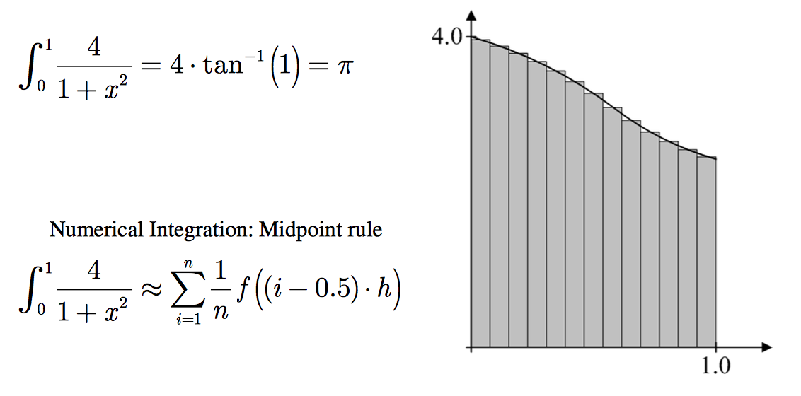

# mpi no Ubuntu 16.04 via Docker

Enquanto a versão do MPI para macOS e Linux está na versão 3.2 
o porte para Windows ainda está na versão 1.0.3

Por este motivo pode ser util usar o MPI num contêiner Docker com Ubuntu 16.04

Este repositório provê esta funcionalidade com algumas aplicações
de teste MPI rodando num contêiner Docker 

Um video mostrando como usar este repositório pode ser visto 
em [docs/how-to-use-this-repo-480p.mov](docs/how-to-use-this-repo-480p.mov)

## Criando e iniciando o Contêiner

Na primeira vez fazer simplesmente:

```bash
./start_container.sh /Users/${USER}/.ssh/id_rsa.pub
```

A shell bash acima irá executar implicitamente o comando
`docker pull parana/mpi` na primeira vez. A imagem será
obtida de [https://hub.docker.com/u/parana/](https://hub.docker.com/u/parana/)

Porém, se desejar criar o contêiner localmente para ajustar o Dockerfile 
as suas necessidades faça o seguinte:

```bash
docker build -t parana/mpi .  && \
    ./start_container.sh /Users/${USER}/.ssh/id_rsa.pub
```

Isso cria a imagem e inicia o contêiner.

Nas outras vezes basta iniciar o contêiner

```bash
./start_container.sh /Users/${USER}/.ssh/id_rsa.pub
```

Observe que deve existir um par de chaves RSA geradas pelo OpneSSH no seu diretório HOME.

No Windows você deve ter instalado o MSYS ou o **git-bash** que pode ser obtido
com [https://git-scm.com/download/win](https://git-scm.com/download/win).

Para ver as imagens Docker geradas use o comando:

```bash
docker images | grep parana
```

Para inspecionar quais contêineres estão executando e quais estão parados execute `docker ps -a`
## Testando o MPI

Para fazer o build dos programas de teste e executá-los use os comandos abaixo dentro do contêiner

```bash
cd desenv/mpi/src/main/c
./build.sh
```

Veja o [desenv/mpi/src/main/c/build.sh](desenv/mpi/src/main/c/build.sh)

### Calculo aproximado de PI

Exemplo baseado [neste PDF](http://sbel.wisc.edu/Courses/ME964/2013/Lectures/lecture1030.pdf)



Um dos exemplos ( [`calc_pi.cpp`](desenv/mpi/src/main/c/calc_pi.cpp) ) mostra como usar Broadcast (`MPI_Bcast`) e Reduce (`MPI_Reduce`) 
para calcular o valor de PI por aproximações com sub-intervalos assinaladosaos *ranks* 
usando **round-robin**

Exemplo com 13 sub-intervalos e 4 processadores: 

* rank 0: 1, 5, 9, 13
* rank 1: 2, 6, 10
* rank 2: 3, 7, 11
* rank 3: 4, 8, 12

Para testar com 4 processadores e e treze subintervalos faça:

```bash
mpiexec -n 4 ./test_3 13
```

Para testar como o erro diminui a medida que aumentamos o número de 
sub-intervalos podemos executar:

```bash
for a in 5 25 50 250 500 2500 5000 25000 50000 250000 500000 2500000
do 
  mpiexec -n 1  ./test_3 $a 
done | grep "Error is"
```

Para conseguir um dos menores erros possíveis use 9.300.000.000 de subintervalos:

```bash
mpiexec -n 5 ./test_3 9300000000
```

